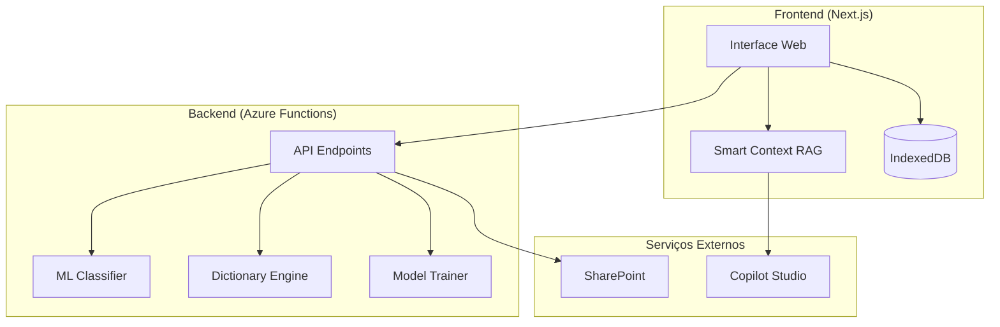

# Spend Analysis AI Agent

Sistema inteligente de classificação de gastos corporativos com Machine Learning e assistente de IA.

---

## 📋 Visão Geral

O **Spend Analysis AI Agent** é uma solução completa para classificação automática de dados de compras corporativas usando:

- **Classificação Híbrida**: Combina Machine Learning (TF-IDF + Logistic Regression) com fallback para dicionário de palavras-chave
- **Aprendizado Contínuo**: Treinamento incremental de modelos por setor
- **Assistente de IA**: Copilot Studio integrado para análise contextual dos dados
- **Smart Context**: Sistema RAG local que enriquece queries com dados relevantes

### Arquitetura



---

## 📁 Estrutura do Projeto

```
az-pg-spend-analysis/
│
├── 📂 Backend (Azure Functions - Python)
│   ├── function_app.py          # Endpoints HTTP
│   ├── src/                     # Módulos de negócio
│   │   ├── taxonomy_engine.py   # Classificação por dicionário
│   │   ├── hybrid_classifier.py # Classificação híbrida ML+Dict
│   │   ├── ml_classifier.py     # Classificador ML puro
│   │   ├── model_trainer.py     # Treinamento de modelos
│   │   ├── preprocessing.py     # Normalização de texto
│   │   └── taxonomy_mapper.py   # Hierarquia customizada
│   ├── models/                  # Artefatos ML por setor
│   ├── tests/                   # Testes unitários
│   └── docs/                    # 📖 Documentação Backend
│
├── 📂 frontend/ (Next.js - TypeScript)
│   ├── src/
│   │   ├── components/          # Componentes React
│   │   ├── hooks/               # Custom Hooks (sessões, chat)
│   │   ├── lib/                 # API client, database, Smart Context
│   │   └── pages/               # Páginas da aplicação
│   ├── public/                  # Assets e dicionário
│   └── docs/                    # 📖 Documentação Frontend
│
└── README.md                    # Este arquivo
```

---

## 📖 Documentação Detalhada

| Área | Documentação |
|------|--------------|
| **Backend** | [docs/README.md](./docs/README.md) - Arquitetura, API, ML, Treinamento |
| **Frontend** | [frontend/docs/README.md](./frontend/docs/README.md) - Componentes, Hooks, Smart Context |

---

## 🚀 Quick Start (Primeira Vez)

### Pré-requisitos

| Ferramenta | Versão | Instalação |
|------------|--------|------------|
| Python | 3.10+ | [python.org](https://www.python.org/downloads/) |
| Node.js | 18+ | [nodejs.org](https://nodejs.org/) |
| Azure Functions Core Tools | 4.x | `npm install -g azure-functions-core-tools@4` |

---

### Backend (Azure Functions - Python)

```bash
# 1. Navegue até a pasta do backend
cd az-pg-spend-analysis

# 2. Crie e ative o ambiente virtual Python
python -m venv .venv
source .venv/bin/activate   # Mac/Linux
# .venv\Scripts\activate    # Windows

# 3. Instale as dependências Python
pip install -r requirements.txt

# 4. Configure as variáveis de ambiente
cp local.settings.json.example local.settings.json
# Edite local.settings.json com suas credenciais (DIRECT_LINE_SECRET, etc.)

# 5. Inicie o servidor backend
func start
```

> ⚠️ O backend roda em `http://localhost:7071/api`

---

### Frontend (Next.js - TypeScript)

```bash
# 1. Navegue até a pasta do frontend
cd frontend

# 2. Instale as dependências Node.js
npm install

# 3. Configure as variáveis de ambiente
echo "NEXT_PUBLIC_API_URL=http://localhost:7071/api" > .env.local
echo "NEXT_PUBLIC_FUNCTION_KEY=" >> .env.local

# 4. Inicie o servidor frontend
npm run dev
```

> ⚠️ O frontend roda em `http://localhost:3000`

---

### Verificar Instalação

1. **Backend**: Acesse `http://localhost:7071/api/get-token` - deve retornar JSON
2. **Frontend**: Acesse `http://localhost:3000` - deve exibir a interface

---

## ⚙️ Configuração

### Backend - `local.settings.json`

```json
{
  "IsEncrypted": false,
  "Values": {
    "FUNCTIONS_WORKER_RUNTIME": "python",
    "USE_ML_CLASSIFIER": "true",
    "DIRECT_LINE_SECRET": "<seu_secret>",
    "POWER_AUTOMATE_URL": "<url_flow_sharepoint>"
  }
}
```

### Frontend - `.env.local`

```env
NEXT_PUBLIC_API_URL=http://localhost:7071/api
NEXT_PUBLIC_FUNCTION_KEY=
```

---

## 🧪 Testes

```bash
# Backend - Testes unitários
cd az-pg-spend-analysis
source .venv/bin/activate
pytest tests/ -v

# Frontend - Build check
cd frontend
npm run build
```

---

## 📦 Deploy

### Backend → Azure Functions

```bash
az login
func azure functionapp publish <NOME_DA_FUNCTION_APP>
```

### Frontend → Vercel

```bash
cd frontend
vercel
```

---

## 🔑 Funcionalidades Principais

| Funcionalidade | Descrição |
|----------------|-----------|
| **Classificação Híbrida** | ML com fallback automático para dicionário |
| **Multi-Setor** | Modelos independentes por setor (Varejo, Educacional, etc.) |
| **Treinamento Cumulativo** | Novos dados complementam histórico |
| **Hierarquia Customizada** | Cliente pode sobrescrever taxonomia |
| **Versionamento de Modelos** | Histórico e rollback de versões |
| **Smart Context** | RAG local para queries ao Copilot |
| **Persistência** | Sessões em IndexedDB, chat em localStorage |
| **Analytics** | Pareto, Gaps, Ambiguidade automáticos |

---

## 📄 Licença

Projeto interno P&G - AI Team.
