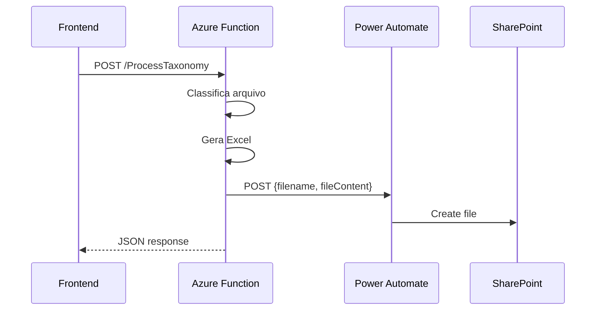

# Arquitetura do Backend

## Overview

O backend segue uma arquitetura modular com **separação clara de responsabilidades**, permitindo operação em dois modos: **Dictionary-only** (padrão) e **Hybrid ML+Dictionary**.

---

## Padrão Arquitetural

```
┌─────────────────────────────────────────────────────────────┐
│                    AZURE FUNCTION APP                       │
│  (function_app.py)                                          │
│  - HTTP Endpoints                                           │
│  - Orquestração                                             │
│  - CORS handling                                            │
└───────────────────────┬─────────────────────────────────────┘
                        │ usa
┌───────────────────────▼─────────────────────────────────────┐
│                    CLASSIFICATION LAYER                     │
│  hybrid_classifier   │  ml_classifier   │ taxonomy_engine   │
│  - Orquestra ML+Dict │  - TF-IDF + LR   │ - Regex patterns  │
│  - Thresholds        │  - Predictions   │ - Keyword match   │
│  - Fallback logic    │  - Confidence    │ - N4 hierarchy    │
└───────────────────────┬─────────────────────────────────────┘
                        │ usa
┌───────────────────────▼─────────────────────────────────────┐
│                    SUPPORT LAYER                            │
│  preprocessing.py │ model_trainer.py │ taxonomy_mapper.py   │
│  - Text normalize │ - Train pipeline │ - Custom hierarchy   │
│  - TF-IDF build   │ - Version control│ - Fallback top 3     │
│  - Noise removal  │ - Model artifacts│ - N4 mapping         │
└───────────────────────┬─────────────────────────────────────┘
                        │ persiste
┌───────────────────────▼─────────────────────────────────────┐
│                    DATA/MODEL LAYER                         │
│  models/{sector}/    │  data/taxonomy/                      │
│  - classifier.pkl    │  - Spend_Taxonomy.xlsx               │
│  - vectorizer.pkl    │  - CONFIG sheet                      │
│  - n4_hierarchy.json │  - DIC_* sheets                      │
└─────────────────────────────────────────────────────────────┘
```

---

## Módulos Principais

### 1. `function_app.py`

**Propósito**: Entry point da Azure Function com todos os endpoints HTTP.

**Endpoints**:
| Endpoint | Método | Descrição |
|----------|--------|-----------|
| `/get-token` | GET | Token Direct Line p/ Copilot |
| `/ProcessTaxonomy` | POST | Classificação de arquivo |
| `/TrainModel` | POST | Treinar modelo ML |
| `/GetModelHistory` | GET | Histórico de versões |
| `/SetActiveModel` | POST | Rollback de versão |

---

### 2. `taxonomy_engine.py`

**Propósito**: Motor de classificação por palavras-chave usando regex.

**Funções principais**:

```python
normalize_text(s: str) -> str
    # Normaliza texto: lowercase, remove acentos, expande abreviações

build_patterns(dict_df) -> (patterns_by_n4, terms_by_n4, taxonomy_by_n4)
    # Constrói regex patterns do dicionário

match_n4_without_priority(desc_norm, patterns, terms, taxonomy)
    # Classifica descrição: retorna (taxonomy, match_type, matched_terms, score)

classify_items(dict_records, item_records)
    # Pipeline completo: retorna {"items", "summary", "analytics"}

generate_analytics(df_items) -> dict
    # Gera Pareto (N1-N4), Gaps, Ambiguidade
```

**Match Types**:
- `Único`: Uma categoria N4 com score mais alto
- `Ambíguo`: Empate entre múltiplas N4s
- `Nenhum`: Nenhuma palavra-chave encontrada

---

### 3. `hybrid_classifier.py`

**Propósito**: Orquestra classificação ML + Dictionary fallback.

**Lógica de Decisão**:
```
ML Confidence >= 0.70 → "Único" (ML)
ML Confidence 0.40-0.69 → "Ambíguo" (Top 3 ML)
ML Confidence < 0.40 → Try Dictionary
    Dictionary match → Use Dictionary
    No match → "Nenhum"
```

**Classe `ClassificationResult`**:
```python
{
    'status': str,    # Único, Ambíguo, Nenhum
    'N1': str, 'N2': str, 'N3': str, 'N4': str,
    'matched_terms': List[str],
    'ml_confidence': float,
    'classification_source': str,  # "ML" or "Dictionary"
    'ambiguous_n4s': List[str]
}
```

---

### 4. `ml_classifier.py`

**Propósito**: Classificação puramente ML com TF-IDF + Logistic Regression.

**Características**:
- Cache de modelos por setor (global `_MODEL_CACHE`)
- Predição com top-K candidatos
- Hierarquia completa (N1→N4) para cada predição

**Artefatos carregados**:
```
models/{sector}/
├── tfidf_vectorizer.pkl    # Vetorizador TF-IDF
├── classifier.pkl          # Logistic Regression
├── label_encoder.pkl       # Encoder de labels
└── n4_hierarchy.json       # Mapeamento N4→N1,N2,N3
```

---

### 5. `model_trainer.py`

**Propósito**: Pipeline de treinamento de modelos ML.

**Etapas**:
1. Filtrar categorias raras (< 5 exemplos)
2. Normalizar descrições
3. Encode labels com LabelEncoder
4. Split train/validation (80/20)
5. TF-IDF vectorization (5000 features, unigrams+bigrams)
6. Train Logistic Regression (OvR)
7. Salvar artefatos versionados
8. Atualizar modelo ativo
9. Cleanup de versões antigas (max 3)

---

### 6. `taxonomy_mapper.py`

**Propósito**: Mapeamento de hierarquia customizada enviada pelo cliente.

**Funções principais**:

```python
load_custom_hierarchy(base64_content: str) -> Dict[str, Dict]
    # Carrega arquivo Excel/CSV com hierarquia customizada
    # Retorna: { "n4_lower": {"N1": ..., "N2": ..., "N3": ..., "N4": ...} }

apply_custom_hierarchy(top_candidates: List[Dict], custom_hierarchy: Dict)
    # Busca melhor match entre top 3 candidates e hierarquia
    # Retorna: (hierarchy_dict, matched_n4) ou (None, None)
```

**Fluxo**:
```
1. ML classifica item -> top 3 candidates
2. Busca 1º candidato na hierarquia -> encontrou? Usa!
3. Busca 2º candidato na hierarquia -> encontrou? Usa!
4. Busca 3º candidato na hierarquia -> encontrou? Usa!
5. Nenhum encontrado -> Item fica sem classificação
```

---

### 7. `preprocessing.py`

**Propósito**: Utilitários compartilhados de pré-processamento.

**Funções**:
- `normalize_text()`: Remove acentos, pontuação, noise words
- `normalize_corpus()`: Batch normalization
- `build_tfidf_vectorizer()`: Cria vetorizador configurado

---

## Configuração

### Variáveis de Ambiente

| Variável | Descrição | Default |
|----------|-----------|---------|
| `USE_ML_CLASSIFIER` | Habilita classificação ML | `false` |
| `DIRECT_LINE_SECRET` | Secret do Copilot Direct Line | - |
| `POWER_AUTOMATE_URL` | URL do Flow para salvar logs no SharePoint | - |
| `POWER_AUTOMATE_API_KEY` | API Key de autenticação do Power Automate | - |

### Constantes (`taxonomy_engine.py`)

```python
PARETO_CLASS_A_THRESHOLD = 0.80   # 80% para Classe A
PARETO_CLASS_B_THRESHOLD = 0.95   # 95% para Classe B
LRU_CACHE_SIZE = 10000            # Cache de classificações
MIN_WORD_LENGTH_FOR_GAPS = 3      # Mínimo para análise gaps
```

---

## Versionamento de Modelos

Modelos são versionados automaticamente em `models/{sector}/versions/`:

```
models/varejo/
├── classifier.pkl              # Modelo ativo
├── tfidf_vectorizer.pkl
├── label_encoder.pkl
├── model_history.json          # Histórico
└── versions/
    ├── v_1/                    # Versão 1
    ├── v_2/                    # Versão 2
    └── v_3/                    # Versão 3 (máximo)
```

### `model_history.json`
```json
[
  {
    "version_id": "v_3",
    "timestamp": "2025-12-13T10:30:00",
    "filename": "dataset.csv",
    "metrics": {
      "accuracy": 0.85,
      "f1_macro": 0.78,
      "total_samples": 5000
    },
    "status": "active"
  }
]
    "metrics": {
      "accuracy": 0.85,
      "f1_macro": 0.78,
      "total_samples": 5000
    },
    "status": "active"
  }
]
```

### Comparação Consistente
Para evitar discrepâncias em visualizações "Antes vs Depois":
1. **Total Samples**: Sempre recalculado a partir do CSV acumulado vs Data, garantindo que o número reflita a realidade dos dados atuais, não o estado do momento do treino (que pode estar obsoleto se houver limpeza de dados).
2. **Hierarquia**: Para versões legadas (sem JSON), o sistema reconstrói a árvore N4->N1 inferindo do CSV.

---

---

## Integração com Power Automate

O backend envia automaticamente cada arquivo classificado para um **Flow do Power Automate**, que salva o arquivo no **SharePoint** como log.

### Fluxo de Integração



### Função `send_to_power_automate()`

```python
def send_to_power_automate(filename: str, file_content_base64: str) -> bool:
    """
    Envia arquivo classificado para o Power Automate (SharePoint).
    - Non-blocking: erros são logados mas não bloqueiam a resposta
    - Timeout: 30 segundos
    """
```

### Payload Enviado

```json
{
    "filename": "arquivo_classified_20251213_170000.xlsx",
    "fileContent": "<base64-encoded-xlsx>"
}
```

### Headers

| Header | Valor |
|--------|-------|
| `Content-Type` | `application/json` |
| `api-key` | Valor de `POWER_AUTOMATE_API_KEY` |

### Configuração no Power Automate

1. **Trigger**: "When an HTTP request is received"
2. **Action**: "Create file" (SharePoint)
   - File Name: `triggerBody()?['filename']`
   - File Content: `base64ToBinary(triggerBody()?['fileContent'])`
