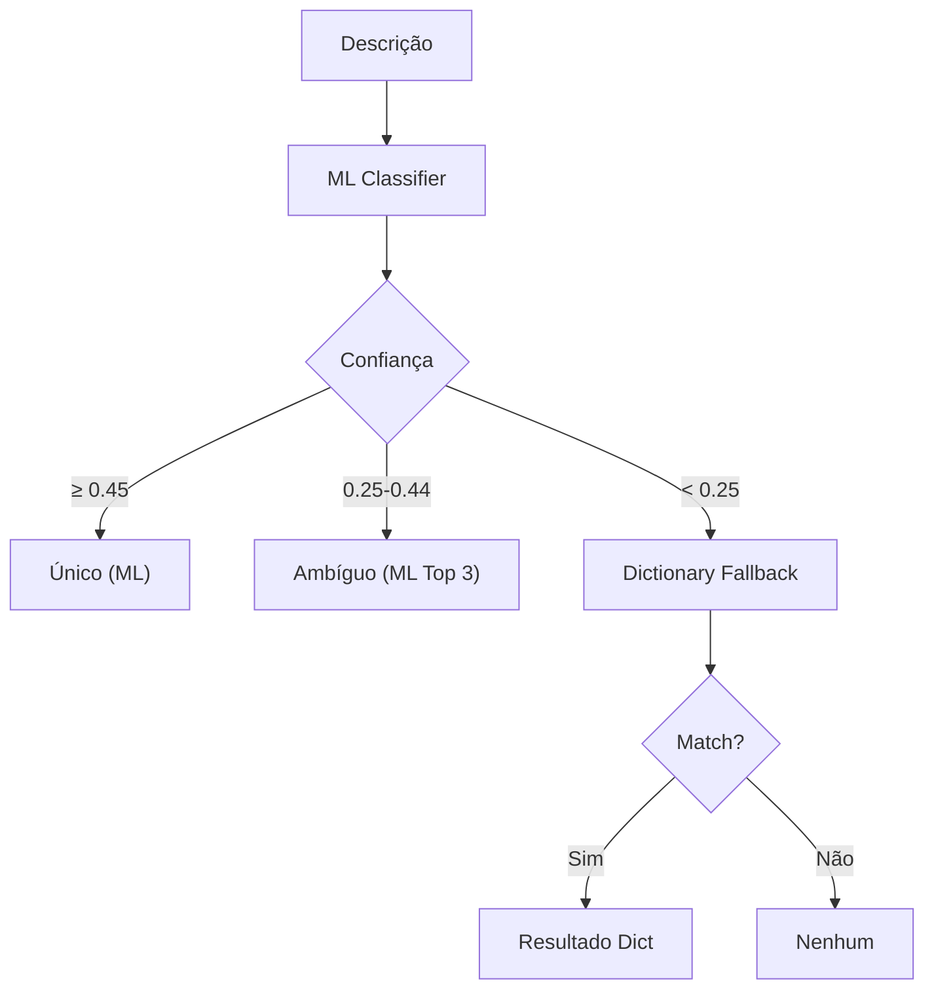

# Classificação com Machine Learning

## Overview

O sistema oferece classificação híbrida que combina **ML (Machine Learning)** com **fallback para dicionário**. O ML usa TF-IDF + Logistic Regression para prever categorias N4 com scores de confiança.

---

## Arquitetura Híbrida



---

## Thresholds de Confiança

| Confiança | Resultado | Fonte | Descrição |
|-----------|-----------|-------|-----------|
| ≥ 0.45 | Único | ML | Alta confiança, usa predição ML |
| 0.25-0.44 | Ambíguo | ML | Média confiança, retorna top 3 candidatos |
| < 0.25 | Fallback | Dictionary | Baixa confiança, tenta dicionário |

> **Nota**: Thresholds mais baixos são usados porque `class_weight='balanced'` distribui probabilidades mais uniformemente entre classes.

---

## Módulos

### `ml_classifier.py`

**Funções principais**:

```python
load_model(sector: str) -> Tuple[vectorizer, classifier, label_encoder, hierarchy]
    # Carrega artefatos do modelo para um setor

predict(texts: List[str], sector: str) -> List[Dict]
    # Prediz N4 para lista de textos com top-K candidatos

predict_single(text: str, sector: str) -> Dict
    # Prediz N4 para um único texto
```

**Cache de Modelos**:
- Modelos são cacheados globalmente por setor
- Evita recarregar em cada requisição

### `hybrid_classifier.py`

**Função principal**:

```python
classify_hybrid(
    description: str,
    sector: str,
    dict_patterns, dict_terms, dict_taxonomy,  # Do taxonomy_engine
    vectorizer, classifier, label_encoder, hierarchy  # Do ml_classifier
) -> ClassificationResult
```

**Classe `ClassificationResult`**:
```python
{
    'status': "Único" | "Ambíguo" | "Nenhum",
    'N1': str, 'N2': str, 'N3': str, 'N4': str,
    'matched_terms': List[str],       # Termos do dicionário (se usado)
    'ml_confidence': float,            # Confiança do ML
    'classification_source': "ML" | "Dictionary" | "None",
    'ambiguous_n4s': List[str]         # Candidatos em caso de ambiguidade
}
```

---

## Artefatos do Modelo

Cada setor tem seus artefatos em `models/{sector}/`:

```
models/varejo/
├── tfidf_vectorizer.pkl     # Vetorizador TF-IDF
├── classifier.pkl           # Logistic Regression (OvR)
├── label_encoder.pkl        # Encoder de labels N4
├── n4_hierarchy.json        # Mapeamento N4 → N1, N2, N3
├── model_history.json       # Histórico de versões
└── versions/                # Versões anteriores
    ├── v_1/
    └── v_2/
```

---

## Pipeline ML

### 1. Pré-processamento
```python
from src.preprocessing import normalize_text, build_tfidf_vectorizer

# Mesma normalização do dicionário
text_norm = normalize_text("Café Torrado Premium")
# → "cafe torrado premium"
```

### 2. Vetorização TF-IDF
```python
vectorizer = build_tfidf_vectorizer(
    max_features=5000,      # Vocabulário máximo
    ngram_range=(1, 2),     # Unigrams + Bigrams
    min_df=2,               # Frequência mínima
    max_df=0.95             # Frequência máxima
)
```

### 3. Classificação
```python
classifier = LogisticRegression(
    C=1.0,
    max_iter=1000,
    multi_class='ovr',      # One-vs-Rest
    n_jobs=-1               # Paralelo
)
```

---

## Habilitando ML

Por padrão, ML está **desabilitado**. Para habilitar:

```bash
# local.settings.json ou variável de ambiente
USE_ML_CLASSIFIER=true
```

Quando habilitado, a função `ProcessTaxonomy` usa o classificador híbrido automaticamente.

---

## Métricas Retornadas

Quando ML é usado, colunas adicionais são incluídas:

| Coluna | Descrição |
|--------|-----------|
| `Match_Score` | Confiança do ML (0-1) |
| `Classification_Source` | "ML" ou "Dictionary" |
| `Needs_Review` | `true` se Ambíguo ou Nenhum |
