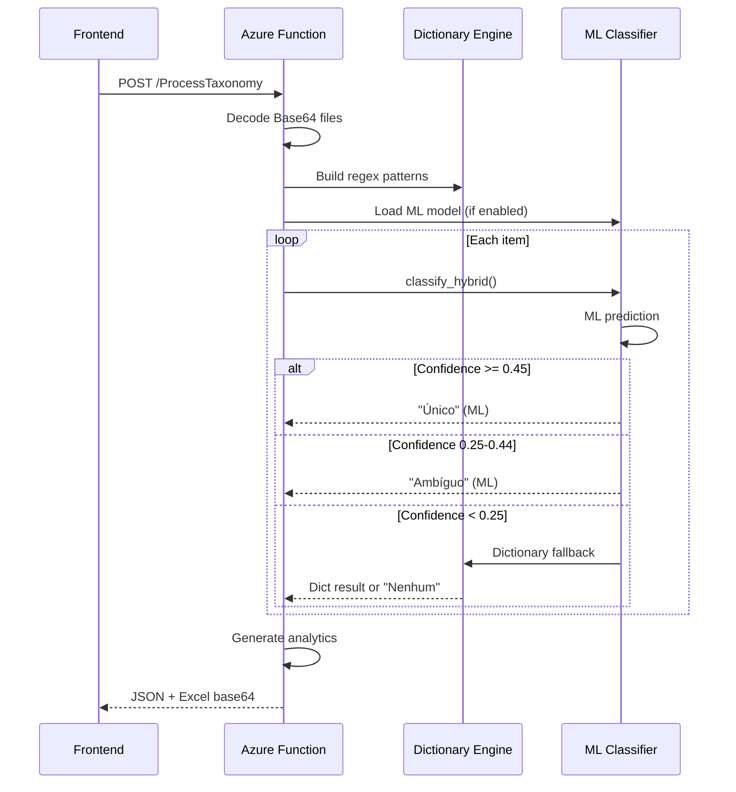

# Documentação do Backend - Spend Analysis AI Agent

Esta documentação descreve a arquitetura, estrutura e funcionamento do backend da aplicação Spend Analysis AI Agent.

## Índice

1. [Arquitetura Geral](./ARCHITECTURE.md)
2. [API Endpoints](./API-ENDPOINTS.md)
3. [Motor de Classificação](./TAXONOMY-ENGINE.md)
4. [Machine Learning](./ML-CLASSIFICATION.md)
5. [Treinamento de Modelos](./TRAINING.md)

---

## Visão Geral

O backend é uma **Azure Function App** em Python que fornece:
- Classificação de gastos baseada em dicionário de palavras-chave
- Classificação híbrida com Machine Learning (ML + Dictionary Fallback)
- **Suporte a hierarquia customizada do cliente** (com fallback para top 3 candidates)
- Treinamento de modelos ML por setor
- Integração com Microsoft Copilot Studio
- Analytics automáticos (Pareto, Gaps, Ambiguidade)
- **Log automático de arquivos classificados no SharePoint** (via Power Automate)

### Stack Tecnológico

| Tecnologia | Versão | Propósito |
|------------|--------|-----------|
| Python | 3.10+ | Linguagem principal |
| Azure Functions | 4.x | Hosting serverless |
| Pandas | 2.x | Processamento de dados |
| Scikit-learn | 1.x | Machine Learning |
| OpenPyXL | 3.x | Leitura/escrita Excel |

---

## Estrutura de Pastas

```
az-pg-spend-analysis/
├── function_app.py          # Azure Function endpoints
├── host.json                # Configuração Azure Functions
├── local.settings.json      # Variáveis de ambiente locais
├── requirements.txt         # Dependências Python
├── src/                     # Módulos de negócio
│   ├── taxonomy_engine.py   # Motor de classificação por dicionário
│   ├── taxonomy_mapper.py   # Mapeamento de hierarquia customizada
│   ├── hybrid_classifier.py # Classificador híbrido ML + Dict
│   ├── ml_classifier.py     # Classificador ML puro
│   ├── model_trainer.py     # Treinamento de modelos
│   └── preprocessing.py     # Normalização de texto
├── models/                  # Artefatos ML por setor
│   ├── varejo/              # Modelo setor varejo
│   └── educacional/         # Modelo setor educacional
├── data/                    # Dados de referência
│   ├── taxonomy/            # Dicionário Spend_Taxonomy.xlsx
│   └── samples/             # Datasets de treinamento
└── tests/                   # Testes unitários e regressão
```

---

## Fluxo Principal



---

## Última Atualização

**Data**: 2025-12-19  
**Versão**: 1.2.0  
**Mudanças**: Thresholds de confiança atualizados (0.45/0.25)
