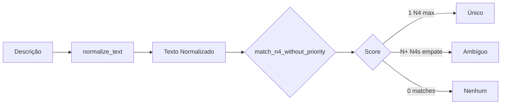

# Motor de Classificação por Dicionário

## Overview

O `taxonomy_engine.py` é o módulo central para classificação de descrições de itens em categorias N4 usando correspondência de palavras-chave baseada em regex.

---

## Fluxo de Classificação



---

## Normalização de Texto

A função `normalize_text()` prepara descrições para matching:

```python
normalize_text("Café com Açúcar 500g")  # → "cafe acucar 500g"
```

**Operações**:
1. Converte para minúsculas
2. Remove acentos (NFD + filtro Mn)
3. Remove pontuação
4. Hifens viram espaços
5. Expande abreviações (`etiq` → `etiqueta`)
6. Remove noise words (`de`, `para`, `com`, etc.)
7. Compacta espaços múltiplos

---

## Construção de Patterns

A função `build_patterns()` transforma o dicionário em estruturas de busca:

### Entrada (DataFrame do Dicionário)
| N1 | N2 | N3 | N4 | Palavras_chave |
|----|----|----|----|----|
| Alimentos | Bebidas | Café | Café em Grãos | café, grãos, torrado |

### Saídas

```python
patterns_by_n4 = {
    "Café em Grãos": [regex("café"), regex("grãos"), regex("torrado")]
}

terms_by_n4 = {
    "Café em Grãos": ["café", "grãos", "torrado"]
}

taxonomy_by_n4 = {
    "Café em Grãos": {"N1": "Alimentos", "N2": "Bebidas", "N3": "Café", "N4": "Café em Grãos"}
}
```

### Stopwords

Termos genéricos são filtrados:
- `kit`, `conjunto`, `peça`, `serviço`, `diversos`, `varios`

---

## Matching de N4

A função `match_n4_without_priority()` busca a categoria mais relevante:

### Algoritmo

1. Para cada N4, conta quantas keywords deram match
2. Score = número de matches
3. Retorna o N4 com maior score

### Tipos de Resultado

| Match Type | Condição |
|------------|----------|
| **Único** | 1 N4 com score máximo |
| **Ambíguo** | 2+ N4s empatados no score máximo |
| **Nenhum** | Score = 0 (nenhum match) |

### Exemplo

```python
# Descrição: "café torrado premium"
# Matches: 
#   - "Café em Grãos": score=2 (café, torrado)
#   - "Café Solúvel": score=1 (café)

# Resultado: Único → "Café em Grãos"
```

---

## Analytics

A função `generate_analytics()` gera insights:

### 1. Pareto (N1-N4)
Distribuição de volume por categoria com classes A/B/C (80/20).

### 2. Gaps (Dictionary Gaps)
Palavras mais frequentes em itens não classificados - oportunidades de expansão do dicionário.

### 3. Ambiguity Analysis
Combinações N4 mais frequentes em ambiguidades - indica palavras-chave sobrepostas.

---

## Configurações

```python
# Constantes em taxonomy_engine.py
PARETO_CLASS_A_THRESHOLD = 0.80   # Top 80% do volume
PARETO_CLASS_B_THRESHOLD = 0.95   # Top 95% do volume
LRU_CACHE_SIZE = 10000            # Cache de classificações
MIN_WORD_LENGTH_FOR_GAPS = 3      # Mínimo para análise de gaps
TOP_GAPS_COUNT = 20               # Top N palavras em gaps
TOP_AMBIGUITY_COUNT = 20          # Top N combinações ambíguas
```

---

## Colunas Suportadas

O módulo aceita várias variações de nomes de colunas:

| Coluna | Variações Aceitas |
|--------|-------------------|
| Descrição | `Item_Description`, `Descricao`, `Descrição`, `Descrição do Item` |
| N4 | `N4_Subcategorias`, `N4_Subcategoria`, `N4`, `Subcategoria N4` |
| Keywords | `Palavras_chave`, `Palavras-chave`, `Keywords` |

---

## Pipeline Completo

```python
from src.taxonomy_engine import classify_items

result = classify_items(
    dict_records=dict_df.to_dict(orient="records"),
    item_records=items_df.to_dict(orient="records"),
    desc_column="Descrição"
)

# result["items"]     → Lista de itens classificados
# result["summary"]   → {total_linhas, unico, ambiguo, nenhum}
# result["analytics"] → {pareto, gaps, ambiguity}
```
