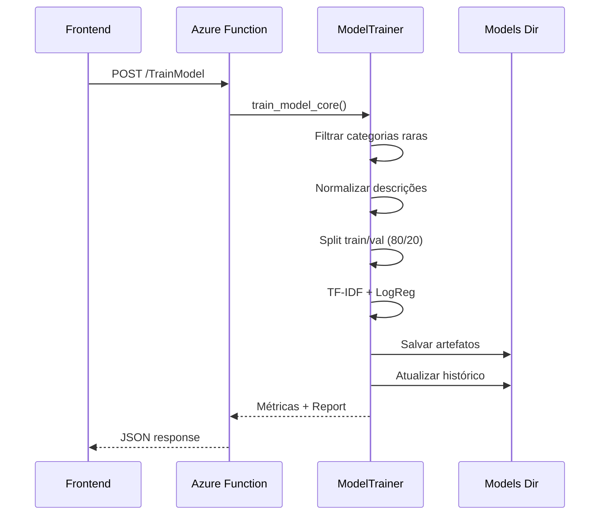

# Treinamento de Modelos ML

## Overview

O sistema suporta treinamento de modelos ML por setor via API. Cada treinamento gera uma nova versão do modelo com métricas.

---

## Fluxo de Treinamento



---

## Via API (Recomendado)

### Endpoint: `/TrainModel`

```json
POST /TrainModel
{
  "fileContent": "<base64-excel>",
  "sector": "varejo",
  "filename": "training_data.xlsx"
}
```

**Colunas Esperadas**:
- `Descrição` (ou variações)
- `N4` (ground truth)

**Response**:
```json
{
  "status": "success",
  "metrics": {
    "accuracy": 0.85,
    "f1_macro": 0.78
  },
  "rawFileContent": "<base64-raw-file>",
  "report": "Training report..."
}
```

---

## Pipeline de Treinamento

O `model_trainer.py` executa:

1. **Filtragem**: Remove categorias com < 5 exemplos
2. **Normalização**: Aplica `normalize_text()` nas descrições
3. **Encoding**: LabelEncoder para N4 → inteiros
4. **Split**: 80% treino, 20% validação (estratificado)
5. **Vetorização**: TF-IDF (5000 features, unigrams+bigrams)
6. **Treinamento**: Logistic Regression (OvR, max_iter=1000, class_weight='balanced')
7. **Avaliação**: Accuracy, F1-Macro, F1-Weighted
8. **Versionamento**: Salva em `versions/v_N/`
9. **Ativação**: Copia para raiz do setor
10. **Cleanup**: Mantém máximo 3 versões

---

## Estrutura de Arquivos

```
models/{sector}/
├── classifier.pkl              # Modelo ativo
├── tfidf_vectorizer.pkl
├── label_encoder.pkl
├── n4_hierarchy.json
├── model_history.json
├── dataset_master.csv          # Dados acumulados
└── versions/
    ├── v_1/
    ├── v_2/
    └── v_3/
```

---

## Treinamento Cumulativo

Cada novo upload de dados é **acumulado**:

1. Carrega `dataset_master.csv` existente
2. Concatena novos dados
3. **Mantém duplicatas** - itens frequentes têm maior peso no treinamento
4. Salva novo `dataset_master.csv`
5. Treina com dados combinados

Isso permite **refinamento incremental** do modelo.

> **Nota**: Duplicatas são mantidas intencionalmente para melhorar a performance em itens frequentes.
> Na aba "Dados" do visualizador, duplicatas são agrupadas e exibidas com uma coluna `Ocorrências`.

---

## Histórico e Comparação

O sistema mantém consistência nas comparações entre versões calculando métricas em tempo real:

1.  **Volume de Dados (Total Samples)**:
    *   Sempre calculado filtrando o `dataset_master.csv` até a data/versão alvo.
    *   Isso garante que a comparação "Atual vs Anterior" reflita a realidade do arquivo de dados, ignorando metadados antigos que poderiam estar incorretos após limpezas de dados.

2.  **Hierarquia (N1-N4)**:
    *   Baseada no snapshot `n4_hierarchy.json` de cada versão.
    *   **Fallback**: Se uma versão antiga (ex: legado) não tiver o JSON de hierarquia, o sistema reconstrói a estrutura hierárquica lendo o CSV filtrado por aquela versão.

`model_history.json`:
```json
[
  {
    "version_id": "v_3",
    "timestamp": "2025-12-13T10:30:00",
    "filename": "training_batch_3.xlsx",
    "metrics": {
      "accuracy": 0.85,
      "f1_macro": 0.78,
      "total_samples": 5000
    },
    "status": "active"
  }
]
```

### Rollback

Via endpoint `/SetActiveModel`:
```json
POST /SetActiveModel
{
  "sector": "varejo",
  "version_id": "v_2"
}
```

---

## Configurações

### Parâmetros de Treinamento

| Parâmetro | Valor | Descrição |
|-----------|-------|-----------|
| `min_examples` | 5 | Mínimo de exemplos por categoria |
| `test_size` | 0.2 | 20% para validação |
| `max_features` | 5000 | Vocabulário TF-IDF |
| `ngram_range` | (1, 2) | Unigrams + Bigrams |
| `class_weight` | balanced | Peso balanceado para classes minoritárias |
| `confidence_unique` | 0.45 | Threshold para classificação "Único" |
| `confidence_ambiguous` | 0.25 | Threshold para classificação "Ambíguo" |
| `MAX_VERSIONS` | 3 | Retenção de versões |

---

## Setores Suportados

| Setor | Status |
|-------|--------|
| `varejo` | ✅ Treinado |
| `educacional` | ✅ Treinado |
| Outros | Adicionar via API |

Para adicionar novo setor:
1. Fazer upload de dados classificados via `/TrainModel`
2. Sistema cria automaticamente `models/{setor}/`
