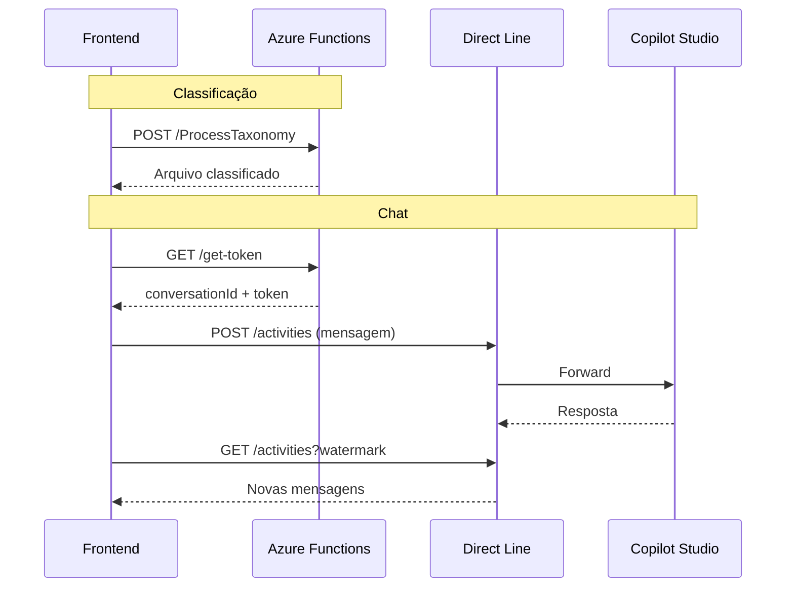

# Endpoints de API

Esta documentação lista todos os endpoints de API consumidos pelo frontend.

---

## Configuração

```typescript
// lib/api.ts
const API_BASE_URL = process.env.NEXT_PUBLIC_API_URL || 'http://localhost:7071/api'
```

---

## Endpoints do Backend (Azure Functions)

### 1. ProcessTaxonomy

Processa arquivo Excel e classifica itens usando ML.

**Endpoint**: `POST /api/ProcessTaxonomy`

**Request**:
```json
{
    "fileContent": "base64...",      // Conteúdo do arquivo em base64
    "dictionaryContent": "base64...", // Dicionário de taxonomia
    "sector": "Varejo",              // Setor selecionado
    "originalFilename": "dados.xlsx"  // Nome do arquivo original
}
```

**Response**:
```json
{
    "sessionId": "uuid-v4",
    "filename": "dados_classified_YYYYMMDD_HHMMSS.xlsx",
    "fileContent": "base64...",
    "summary": {
        "totalItems": 3381,
        "classifiedItems": 3153,
        "classificationRate": "93.3%",
        "uniqueClassifications": 2218,
        "ambiguousClassifications": 935
    },
    "analytics": {
        "topCategories": [
            { "category": "Alimentos", "count": 593 },
            { "category": "Ferramentas", "count": 291 }
        ]
    },
    "items": [...]
}
```

---

### 2. TrainModel

Treina novo modelo ML com arquivo de exemplo.

**Endpoint**: `POST /api/TrainModel`

**Request**:
```json
{
    "fileContent": "base64...",
    "sector": "Educacional",
    "filename": "treino_final.xlsx"
}
```

**Response**:
```json
{
    "success": true,
    "version_id": "v2024-12-12-1430",
    "report": "Training completed...\nAccuracy: 94.5%...",
    "rawFilename": "training_result.xlsx",
    "rawFileContent": "base64..."
}
```

---

### 3. GetModelHistory

Retorna histórico de versões de modelos por setor.

**Endpoint**: `GET /api/GetModelHistory?sector={sector}`

**Response**:
```json
[
    {
        "version_id": "v2024-12-12-1430",
        "timestamp": "2024-12-12T14:30:00Z",
        "filename": "treino_final.xlsx",
        "status": "active",
        "metrics": {
            "accuracy": 0.945
        }
    },
    {
        "version_id": "v2024-12-10-0900",
        "timestamp": "2024-12-10T09:00:00Z",
        "filename": "treino_v1.xlsx",
        "metrics": {
            "accuracy": 0.921
        }
    }
]
```

```json
[
    {
        "version_id": "v2024-12-12-1430",
        "timestamp": "2024-12-12T14:30:00Z",
        "filename": "treino_final.xlsx",
        "status": "active",
        "metrics": {
            "accuracy": 0.945,
            "f1_macro": 0.890
        }
    },
    // ...
]
```

---

### 3.1 GetModelInfo (Novo)

Retorna detalhes completos de uma versão, incluindo hierarquia e comparação.

**Endpoint**: `GET /api/GetModelInfo?sector={sector}&version_id={version_id}`

**Response**:
```json
{
    "sector": "Educacional",
    "version_id": "v_2",
    "hierarchy": {
        "N1_count": 12,
        "N4_count": 500
    },
    "metrics": {
        "accuracy": 0.945,
        "f1_macro": 0.890,
        "total_samples": 5000
    },
    "comparison": {
        "previous_version": "v_1",
        "metrics": {
            "accuracy": 0.920,
            "f1_macro": 0.850,
            "total_samples": 4500,
            "n1_count": 11,
            "n4_count": 480
        }
    }
}
```

Define qual versão de modelo usar para classificação.

**Endpoint**: `POST /api/SetActiveModel`

**Request**:
```json
{
    "sector": "Varejo",
    "version_id": "v2024-12-10-0900"
}
```

**Response**:
```json
{
    "success": true,
    "message": "Model version v2024-12-10-0900 is now active for Varejo"
}
```

---

### 5. get-token

Obtém token Direct Line para comunicação com Copilot Studio.

**Endpoint**: `GET /api/get-token`

**Response**:
```json
{
    "conversationId": "abc123...",
    "token": "jwt-token...",
    "expires_in": 3600
}
```

---

## Endpoints do Direct Line (Copilot Studio)

O frontend se comunica diretamente com o Microsoft Bot Framework via Direct Line.

### Enviar Mensagem

**Endpoint**: `POST https://directline.botframework.com/v3/directline/conversations/{conversationId}/activities`

**Headers**:
```
Authorization: Bearer {token}
Content-Type: application/json
```

**Request**:
```json
{
    "type": "message",
    "from": { "id": "user" },
    "locale": "pt-BR",
    "text": "Mensagem enriquecida com Smart Context..."
}
```

---

### Obter Mensagens

**Endpoint**: `GET https://directline.botframework.com/v3/directline/conversations/{conversationId}/activities?watermark={watermark}`

**Headers**:
```
Authorization: Bearer {token}
```

**Response**:
```json
{
    "activities": [
        {
            "type": "message",
            "from": { "id": "bot" },
            "text": "Resposta do Copilot..."
        }
    ],
    "watermark": "12345"
}
```

---

## Cliente HTTP

O `apiClient` em `lib/api.ts` encapsula todas as chamadas:

```typescript
export const apiClient = {
    // Azure Functions
    getDirectLineToken(): Promise<DirectLineToken>
    processTaxonomy(fileContent, dictionaryContent, sector, filename, customHierarchy?): Promise<any>
    trainModel(fileContent, sector, filename): Promise<any>
    getModelHistory(sector): Promise<any[]>
    setActiveModel(sector, versionId): Promise<any>
    getModelInfo(sector, versionId?): Promise<any>
    getTrainingData(sector, page, pageSize, filters?): Promise<any>  // Retorna dados agrupados com Ocorrências
    deleteTrainingData(sector, options): Promise<any>  // options: {version?, items?, row_ids?}
    
    // Direct Line
    postActivity(conversationId, token, activity): Promise<any>
    sendMessageToCopilot(conversationId, token, text, value?): Promise<void>
    getMessagesFromCopilot(conversationId, token, watermark?): Promise<any>
}
```

---

## Diagrama de Comunicação


