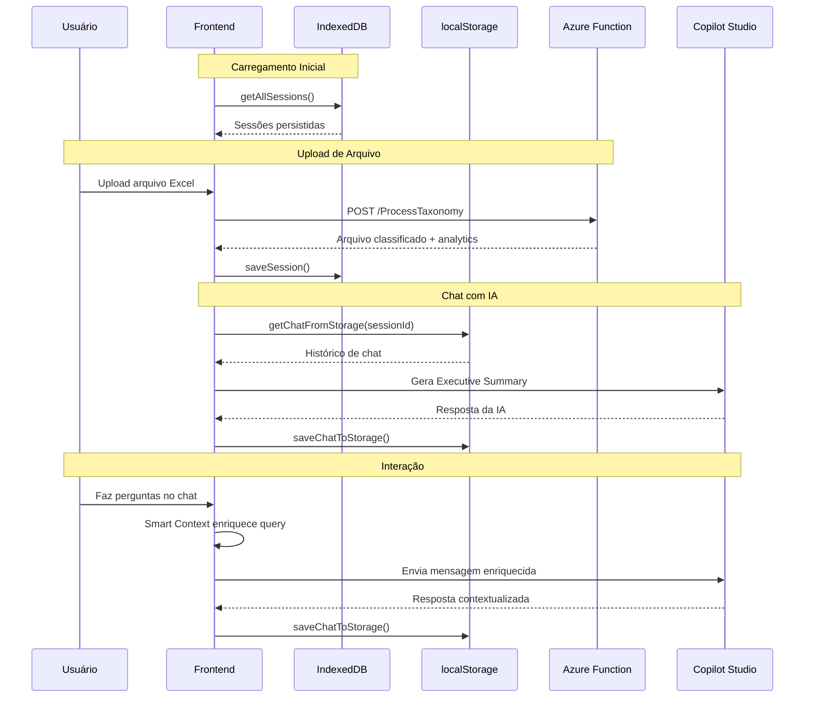

# Documentação do Frontend - Spend Analysis AI Agent

Esta documentação descreve a arquitetura, estrutura e funcionamento do frontend da aplicação Spend Analysis AI Agent.

## Índice

1. [Arquitetura Geral](./ARCHITECTURE.md)
2. [Gerenciamento de Sessões](./SESSIONS.md)
3. [Smart Context (Local RAG)](./SMART-CONTEXT.md)
4. [Endpoints de API](./API-ENDPOINTS.md)
5. [Componentes](./COMPONENTS.md)

---

## Visão Geral

O frontend é uma aplicação **Next.js 14** que fornece:
- Upload e classificação de arquivos de gastos
- Chat com IA via Microsoft Copilot Studio
- Treinamento e gerenciamento de modelos ML
- Sistema de Smart Context para enriquecimento de queries
- **Persistência de sessões** em IndexedDB
- **Persistência de chat** em localStorage

### Stack Tecnológico

| Tecnologia | Versão | Propósito |
|------------|--------|-----------|
| Next.js | 14.2.3 | Framework React |
| TypeScript | 5.x | Tipagem estática |
| TailwindCSS | 3.x | Estilização |
| Axios | 1.x | Requisições HTTP |
| XLSX | 0.18.x | Processamento Excel |
| React Markdown | 9.x | Renderização MD |
| **idb** | 8.x | IndexedDB wrapper |

---

## Estrutura de Pastas

```
frontend/
├── docs/                    # Documentação
├── public/                  # Assets estáticos
│   ├── pg-logo.png
│   ├── agent-icon.png
│   └── Spend_Taxonomy.xlsx
├── src/
│   ├── components/
│   │   ├── chat/           # ChatMessage, ChatInput
│   │   ├── taxonomy/       # SessionSidebar, DownloadCard, etc.
│   │   └── ui/             # Button, Card, Tabs
│   ├── hooks/
│   │   ├── useCopilot.ts   # Comunicação com IA + localStorage
│   │   ├── useTaxonomySession.ts  # Sessões + IndexedDB
│   │   └── useModelTraining.ts    # Treinamento ML
│   ├── lib/
│   │   ├── api.ts          # Cliente HTTP
│   │   ├── database.ts     # IndexedDB (sessões)
│   │   ├── design-tokens.ts # Tokens de design
│   │   └── smart-context/  # Sistema de RAG local
│   ├── pages/
│   │   ├── index.tsx       # Home page
│   │   └── taxonomy.tsx    # Página principal
│   └── styles/
│       └── globals.css     # Estilos globais
└── package.json
```

---

## Fluxo Principal



---

## Funcionalidades de Persistência

### Sessões (IndexedDB)
- ✅ Persistem ao recarregar página
- ✅ Arquivo para download reconstruído de base64
- ✅ Suporte a múltiplas sessões simultâneas
- ✅ Exclusão individual ou em massa

### Chat (localStorage)
- ✅ Histórico por sessão
- ✅ Sincronização automática
- ✅ Limpo junto com sessão

---

## Quick Links

- [Como funciona o Smart Context](./SMART-CONTEXT.md)
- [Como as sessões são gerenciadas](./SESSIONS.md)
- [Lista de endpoints de API](./API-ENDPOINTS.md)
- [Componentes disponíveis](./COMPONENTS.md)

---

## Última Atualização

**Data**: 2025-12-13  
**Versão**: 1.1.0  
**Mudanças**: Adicionada persistência IndexedDB e localStorage
