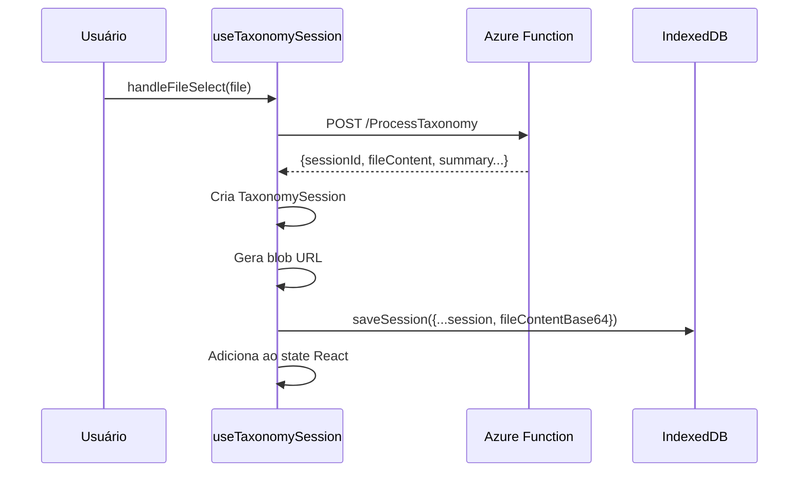

# Gerenciamento de Sessões

O sistema de sessões permite que o usuário tenha múltiplas análises de arquivos ativas simultaneamente, com **persistência completa** em IndexedDB e localStorage.

---

## Estrutura de uma Sessão

```typescript
interface TaxonomySession {
    sessionId: string         // ID único gerado pelo backend
    filename: string          // Nome do arquivo original
    sector: string            // Setor selecionado (Varejo, Educacional, etc.)
    timestamp: string         // Data/hora de criação
    summary?: any             // Resumo estatístico do backend
    analytics?: any           // Dados analíticos (top categorias, etc.)
    items?: any[]             // Lista de itens classificados
    downloadUrl?: string      // URL do blob para download (runtime only)
    downloadFilename?: string // Nome do arquivo classificado
    fileContentBase64?: string // Conteúdo base64 para recriar download
}
```

---

## Camadas de Persistência

### 1. IndexedDB (Sessões)

Gerenciado pelo módulo `lib/database.ts` usando a biblioteca [`idb`](https://github.com/jakearchibald/idb).

**Schema**:
```typescript
interface SpendAnalysisDB extends DBSchema {
    sessions: {
        key: string // sessionId
        value: TaxonomySession
        indexes: { 'by-timestamp': string }
    }
}
```

**Funções Disponíveis**:
| Função | Descrição |
|--------|-----------|
| `saveSession(session)` | Salva/atualiza sessão |
| `getSession(sessionId)` | Busca sessão por ID |
| `getAllSessions()` | Lista todas (ordenadas por timestamp) |
| `deleteSession(sessionId)` | Remove sessão específica |
| `clearAllSessions()` | Remove todas as sessões |

### 2. LocalStorage (Chat)

O histórico de chat é persistido separadamente por sessão.

**Prefixo**: `pg_spend_chat_{sessionId}`

**Funções** (em `useCopilot.ts`):
```typescript
getChatFromStorage(sessionId): Message[]
saveChatToStorage(sessionId, messages): void
```

---

## Ciclo de Vida da Sessão

### 1. Carregamento Inicial

Ao montar o componente, sessões são carregadas do IndexedDB:

```typescript
useEffect(() => {
    const loadSessions = async () => {
        const storedSessions = await getAllSessions()
        if (storedSessions.length > 0) {
            // Recriar blob URLs para download
            const sessionsWithUrls = storedSessions.map(session => {
                if (session.fileContentBase64) {
                    const blob = base64ToBlob(session.fileContentBase64, ...)
                    return { ...session, downloadUrl: URL.createObjectURL(blob) }
                }
                return session
            })
            setSessions(sessionsWithUrls)
        }
    }
    loadSessions()
}, [])
```

### 2. Criação de Nova Sessão



### 3. Carregamento de Chat

Quando uma sessão é selecionada:

```typescript
useEffect(() => {
    if (sessionId) {
        const stored = getChatFromStorage(sessionId)
        setCopilotMessages(stored)
        setChatHistory(stored)
    } else {
        setCopilotMessages([])
        setChatHistory([])
    }
}, [sessionId])
```

### 4. Persistência de Chat

Cada atualização de mensagens é automaticamente salva:

```typescript
const updateMessages = useCallback((newMessages: Message[]) => {
    setCopilotMessages(newMessages)
    setChatHistory(newMessages)
    if (sessionId) {
        saveChatToStorage(sessionId, newMessages)
    }
}, [sessionId])
```

---

## Operações de Limpeza

### Limpar Todo Histórico

```typescript
const handleClearHistory = async () => {
    // 1. Limpar IndexedDB
    await clearAllSessions()
    
    // 2. Limpar localStorage (chats)
    const keysToRemove: string[] = []
    for (let i = 0; i < localStorage.length; i++) {
        const key = localStorage.key(i)
        if (key?.startsWith('pg_spend_chat_')) {
            keysToRemove.push(key)
        }
    }
    keysToRemove.forEach(key => localStorage.removeItem(key))
    
    // 3. Limpar React state
    setSessions([])
    setActiveSessionId(null)
}
```

### Deletar Sessão Individual

```typescript
const handleDeleteSession = async (sessionId: string) => {
    await deleteSession(sessionId) // IndexedDB
    localStorage.removeItem(`pg_spend_chat_${sessionId}`) // Chat
    setSessions(prev => prev.filter(s => s.sessionId !== sessionId))
}
```

---

## Blob URLs e Download

Blob URLs não podem ser persistidos (são temporários). O sistema:

1. **Salva**: `fileContentBase64` no IndexedDB
2. **Reconstrói**: Blob URL ao carregar sessão

```typescript
const base64ToBlob = (base64: string, contentType: string): Blob => {
    const byteCharacters = atob(base64)
    const byteNumbers = new Array(byteCharacters.length)
    for (let i = 0; i < byteCharacters.length; i++) {
        byteNumbers[i] = byteCharacters.charCodeAt(i)
    }
    const byteArray = new Uint8Array(byteNumbers)
    return new Blob([byteArray], { type: contentType })
}
```

---

## Fluxo Visual

```
┌─────────────────────────────────────────────────────────────┐
│                      Página Carrega                         │
└─────────────────────────────┬───────────────────────────────┘
                              ▼
┌─────────────────────────────────────────────────────────────┐
│           getAllSessions() → IndexedDB                      │
│           Recriar blob URLs de fileContentBase64            │
└─────────────────────────────┬───────────────────────────────┘
                              ▼
┌─────────────────────────────────────────────────────────────┐
│        Usuário seleciona sessão no Sidebar                  │
└─────────────────────────────┬───────────────────────────────┘
                              ▼
┌─────────────────────────────────────────────────────────────┐
│      getChatFromStorage(sessionId) → localStorage           │
│      Carrega mensagens anteriores do chat                   │
└─────────────────────────────┬───────────────────────────────┘
                              ▼
┌─────────────────────────────────────────────────────────────┐
│            Usuário conversa com IA                          │
│            saveChatToStorage() a cada mensagem              │
└─────────────────────────────┬───────────────────────────────┘
                              ▼
┌─────────────────────────────────────────────────────────────┐
│      Usuário fecha conversa (Botão X)                       │
│      setActiveSessionId(null) → Retorna à seleção           │
└─────────────────────────────────────────────────────────────┘
```

---

## Considerações de Performance

- **IndexedDB**: Ideal para dados estruturados grandes (sessões com items[])
- **LocalStorage**: Limite ~5MB; bom para chat messages
- **Blob URLs**: Recriados sob demanda para evitar memory leaks

---

## Dependências

```json
{
  "idb": "^8.x" // Wrapper para IndexedDB
}
```

Instalação: `npm install idb`
